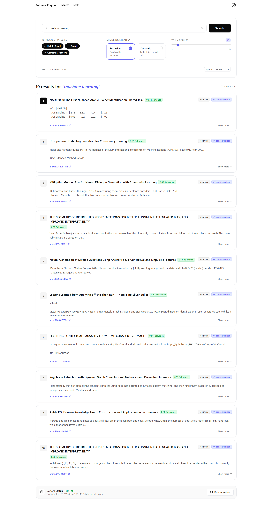
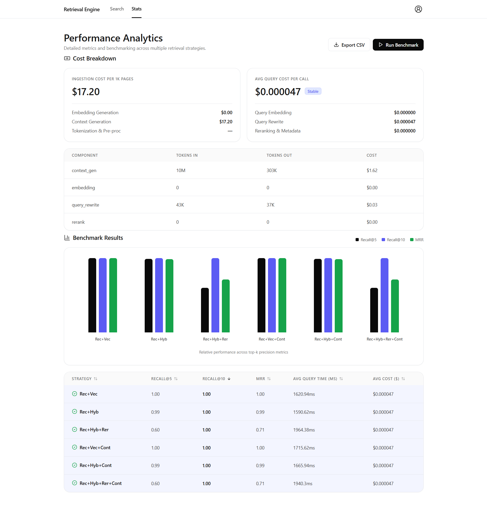

# Retrieval Engine

A production-grade retrieval-augmented generation benchmark over arXiv papers. Search, evaluate, and compare multiple retrieval strategies — vector, hybrid (RRF), rerank, and contextual retrieval — over 120+ ingested research papers from cs.AI and cs.CL.




## Architecture

```
┌──────────────┐     ┌──────────────────────────────────────┐
│   Frontend   │────▶│           FastAPI Backend             │
│  React+TS    │◀────│                                      │
│  (Vite)      │     │  /ingest   /search   /stats   /bench │
└──────────────┘     └────────┬─────────────────┬───────────┘
                              │                 │
                     ┌────────▼──┐    ┌────────▼──────────┐
                     │  pgvector  │    │   External APIs   │
                     │  (HNSW)    │    │     OpenAI LLM    │
                     └────────────┘    └───────────────────┘
```

## Tech Stack

| Layer | Technology |
|-------|-----------|
| Backend | Python 3.12 + FastAPI |
| Vector DB | PostgreSQL 16 + pgvector + HNSW |
| PDF Parsing | Docling |
| Embeddings | all-MiniLM-L6-v2 (384d, local) |
| Context / Query Rewrite | GPT-4o-mini |
| Reranking | BAAI/bge-reranker-base (local) |
| Frontend | Vite + React 18 + TypeScript + Tailwind |

## Setup

1. **Clone and prepare environment:**

```bash
cp .env.example .env
# Edit .env and fill in your OPENAI_API_KEY
```

2. **Start PostgreSQL:**

```bash
docker compose up -d postgres
```

3. **Install dependencies and run ingestion:**

```bash
uv sync
uv run python -m backend.ingestion.pipeline
```

4. **Start the backend:**

```bash
uv run uvicorn backend.main:app --reload --port 8000
```

5. **Start the frontend:**

```bash
cd frontend
npm install
npm run dev
```

6. **Open** `http://localhost:5173`

## API Reference

| Method | Endpoint | Description |
|--------|----------|-------------|
| `GET` | `/healthz` | Health check (DB connectivity) |
| `POST` | `/api/search` | Search with strategy params |
| `POST` | `/api/ingest` | Trigger ingestion (returns task_id) |
| `GET` | `/api/ingest/status/{task_id}` | Poll ingestion progress |
| `GET` | `/api/stats` | Aggregated stats + costs |
| `GET` | `/api/stats/detail` | Cost breakdown by component |
| `POST` | `/api/benchmark` | Run benchmark (returns run_id) |
| `GET` | `/api/benchmark/status/{run_id}` | Poll benchmark progress |
| `GET` | `/api/benchmark/results` | Latest benchmark results |
| `POST` | `/api/benchmark/cancel` | Cancel a running benchmark |

## Quality Gates

```bash
# Backend
uv run ruff check .
uv run mypy backend
uv run pytest

# Frontend
cd frontend
npm run typecheck
npm run build
```

## Build History

Phased implementation plan is documented in [`docs/phases/`](docs/phases/).

| Phase | Description |
|-------|-------------|
| [1](docs/phases/phase-1-infrastructure.md) | Infrastructure & Data Layer |
| [2](docs/phases/phase-2-ingestion.md) | Ingestion Pipeline |
| [3](docs/phases/phase-3-retrieval.md) | Retrieval Engine |
| [4](docs/phases/phase-4-benchmarking.md) | Benchmarking |
| [5](docs/phases/phase-5-cost-tracking.md) | Cost Tracking |
| [6](docs/phases/phase-6-frontend-scaffold.md) | Frontend Scaffold |
| [7](docs/phases/phase-7-frontend-search.md) | Frontend Search Page |
| [8](docs/phases/phase-8-frontend-stats.md) | Frontend Stats Page |
| [9](docs/phases/phase-9-api-routes.md) | API Routes |
| [10](docs/phases/phase-10-integration-polish.md) | Integration & Polish |
